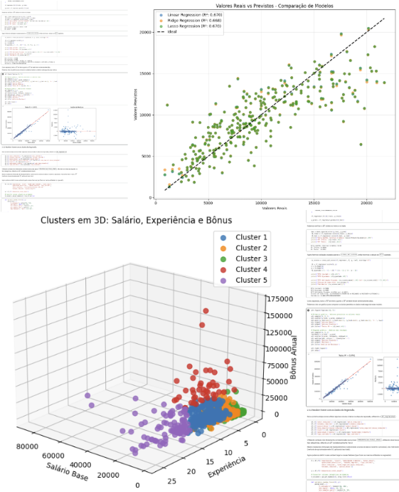
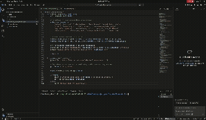

# Projeto Observatório: Análise e Predição de Salários de Desenvolvedores no Brasil
Esse repositório reúne uma série de projetos que fiz com alguns colegas do IMPATech. O projeto abrange desde a coleta dos dados até a análise final, foram utilizados conceitos aprendidos na matéria de Machine Learning e nossa intenção é explicar da forma mais clara possível cada etapa do processo.

## Sobre o Projeto
Este projeto foi desenvolvido como trabalho final para a disciplina de Aprendizado de Máquina 1 do IMPA Tech. O objetivo central é investigar o cenário de remuneração de profissionais de tecnologia no Brasil. O projeto é dividido em duas grandes etapas: a coleta automatizada de dados (Web Scraping) e a aplicação de modelos preditivos e de clusterização (Machine Learning).

1. Coleta de Dados (Web Scraping)
Os dados foram extraídos da plataforma Salário Transparente, onde profissionais compartilham anonimamente suas remunerações.

Abordagem Técnica:

Utilização da biblioteca Selenium para automação do navegador, permitindo interações dinâmicas como inserção de texto, simulação de cliques (para fechar modais/pop-ups) e rolagem contínua da página (lazy loading).

Processamento do HTML extraído utilizando BeautifulSoup para localizar e estruturar as informações dos "cards" de vagas (cargo, empresa, salário base, benefícios, modelo de trabalho, etc.).

O script está consolidado no arquivo Scraping.ipynb, capaz de exportar os dados brutos para formato CSV de forma automatizada.

Vídeo do Scraping sendo feito automaticamente com o Selenium

2. Machine Learning e Análise Exploratória
Com a base de dados construída, o projeto explora o comportamento do mercado de tecnologia através de diferentes vertentes do aprendizado de máquina:

Regressão: Previsão da remuneração total mensal baseada em atributos do profissional e da vaga. Foram testados modelos lineares (Regressão Linear, Ridge, Lasso), Random Forest, Splines e GAMs, identificando as variáveis que mais impactam o salário final.

Classificação de Senioridade: Modelagem para prever o nível do desenvolvedor (Júnior, Pleno, Sênior) utilizando métodos como Regressão Logística, Extra Trees, Gradient Boosting e Voting Classifiers (que apresentou a melhor acurácia na generalização).

Clusterização (K-Means & PCA): Aprendizado não supervisionado para segmentar e agrupar vagas por similaridade técnica e financeira, revelando fronteiras e sobreposições reais no mercado de trabalho.

Como Executar
Você pode explorar os códigos e os resultados de duas maneiras:

Direto no Navegador (Recomendado para ML)
A forma mais rápida de visualizar a análise exploratória e os modelos é através do Google Colab.

Nota sobre o Scraping: O código de Scraping exige configurações específicas de ambiente (headless browser). Embora configurado para rodar no Colab, a execução local é frequentemente mais estável e permite ver o navegador operando visualmente.

Rodando Localmente
Para rodar os scripts e treinar os modelos em sua máquina, certifique-se de ter o Python instalado e siga os passos abaixo:

Clone o repositório:

Bash
git clone https://github.com/seu-usuario/nome-do-repositorio.git
cd nome-do-repositorio
Instale as dependências:
Utilizamos bibliotecas padrão de ciência de dados e automação web.

Bash
pip install pandas numpy matplotlib seaborn altair scikit-learn pygam selenium beautifulsoup4 jupyter
Execute os notebooks:
Inicie o ambiente Jupyter para explorar os arquivos separadamente:

Bash
jupyter notebook
Abra Scraping.ipynb para ver ou refazer a extração de dados.

Abra Machine_Learning.ipynb para visualizar o pré-processamento, análise exploratória e treinamento dos modelos.

Estrutura do Repositório
📄 Scraping.ipynb: Script de automação e coleta de dados via Selenium e BeautifulSoup.

📄 Machine_Learning.ipynb: Pipeline completo de dados, desde o tratamento de outliers até o treinamento de modelos supervisionados e não-supervisionados.

📁 data/: (Se aplicável) Pasta contendo os arquivos CSV gerados pelo scraping para garantir a reprodutibilidade das análises.
