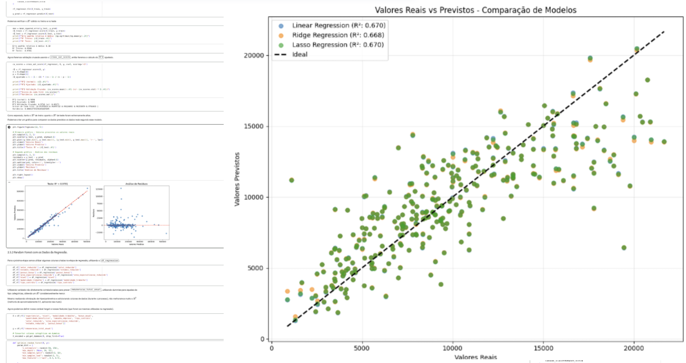

# Projeto Observatório: Análise e Predição de Salários de Desenvolvedores no Brasil
Esse repositório reúne uma série de projetos que fiz com alguns colegas do IMPATech. O projeto abrange desde a coleta dos dados até a análise final, foram utilizados conceitos aprendidos na matéria de Machine Learning e nossa intenção é explicar da forma mais clara possível cada etapa do processo.

## Sobre o Projeto
O objetivo inicial desse projeto foi investigar o cenário de remuneração de cientistas de dados no Brasil. Porém uma das etapas do projeto, usar modelos de Machine Learning para previsão de salário com base em outros preditores, foi feito com dados da profissão de desenvolvedor, por haver uma maior quantidade de dados.

O projeto se divide em três grandes etapas:

1. Coleta de Dados;
2. Análise Exploratória e Machine Learning;
3. Implementação ou Deploy (ainda em desenvolvimento...)

Por enquanto, vou falar mais sobre as duas primeiras.

## 1. Coleta de Dados (Web Scraping)

Vídeo do Scraping sendo feito automaticamente com o Selenium

Os dados foram extraídos da plataforma [Salário Transparente](https://salariotransparente.com.br/), onde profissionais compartilham anonimamente suas remunerações.

# Abordagem Técnica:

Utilizei a biblioteca `Selenium` para automação do navegador, pois permmite:
- Interações dinâmicas como inserção de texto;
- Simulação de cliques para fechar pop-ups;
- Rolagem contínua da página (Lazy loading).

Utilizei também a biblioteca `BeautifulSoup` para processar o HTML extraído de forma que as informações dos cards das vagas estivessem estruturas.

O script se encontra no arquivo `scraping.py`, porém o `scraping.ipynb` provê uma explicação mais detalhada do papel dessas bibliotecas.

2. Machine Learning e Análise Exploratória
Com a base de dados construída, o projeto explora o comportamento do mercado de tecnologia através de diferentes vertentes do aprendizado de máquina:

Regressão: Previsão da remuneração total mensal baseada em atributos do profissional e da vaga. Foram testados modelos lineares (Regressão Linear, Ridge, Lasso), Random Forest, Splines e GAMs, identificando as variáveis que mais impactam o salário final.

Classificação de Senioridade: Modelagem para prever o nível do desenvolvedor (Júnior, Pleno, Sênior) utilizando métodos como Regressão Logística, Extra Trees, Gradient Boosting e Voting Classifiers (que apresentou a melhor acurácia na generalização).

Clusterização (K-Means & PCA): Aprendizado não supervisionado para segmentar e agrupar vagas por similaridade técnica e financeira, revelando fronteiras e sobreposições reais no mercado de trabalho.

Como Executar
Você pode explorar os códigos e os resultados de duas maneiras:

Direto no Navegador (Recomendado para ML)
A forma mais rápida de visualizar a análise exploratória e os modelos é através do Google Colab.

Nota sobre o Scraping: O código de Scraping exige configurações específicas de ambiente (headless browser). Embora configurado para rodar no Colab, a execução local é frequentemente mais estável e permite ver o navegador operando visualmente.

Rodando Localmente
Para rodar os scripts e treinar os modelos em sua máquina, certifique-se de ter o Python instalado e siga os passos abaixo:

Clone o repositório:

Bash
git clone https://github.com/seu-usuario/nome-do-repositorio.git
cd nome-do-repositorio
Instale as dependências:
Utilizamos bibliotecas padrão de ciência de dados e automação web.

Bash
pip install pandas numpy matplotlib seaborn altair scikit-learn pygam selenium beautifulsoup4 jupyter
Execute os notebooks:
Inicie o ambiente Jupyter para explorar os arquivos separadamente:

Bash
jupyter notebook
Abra Scraping.ipynb para ver ou refazer a extração de dados.

Abra Machine_Learning.ipynb para visualizar o pré-processamento, análise exploratória e treinamento dos modelos.

Estrutura do Repositório
📄 Scraping.ipynb: Script de automação e coleta de dados via Selenium e BeautifulSoup.

📄 Machine_Learning.ipynb: Pipeline completo de dados, desde o tratamento de outliers até o treinamento de modelos supervisionados e não-supervisionados.

📁 data/: (Se aplicável) Pasta contendo os arquivos CSV gerados pelo scraping para garantir a reprodutibilidade das análises.
